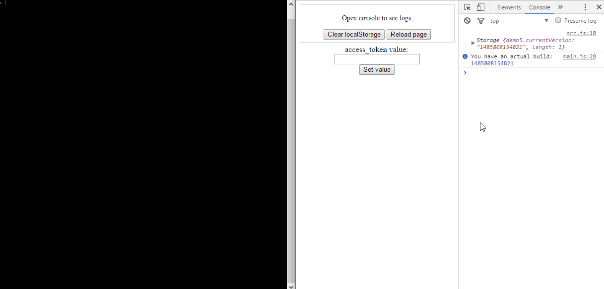

## Application Version Manager

> Flexible utility via pure JavaScript to work with client application cache. Here is an example how it works in real projects. 

**Notice:** Version Manager has no UI, only internal JavaScript implementation. Just include it in your project & configure!

## Table of Contents

  * [Installation](#installation)
  * [Configuration](#configuration)
    - [Common options](#common-options)
    - [Auto-Copy options](#auto-copy-options)
  * [Example](#example)
  * [Demos](#demo)
  * [Questions](#questions)
  * [Licence](#licence)

## Installation

1. `cd core`.
2. `npm install`.
3. `node generator.js` (or just execute `build.bat`).

## Demo

1. [direct-keys-specifying](https://github.com/asduser/app-version-manager/tree/master/demos/1-direct-keys-specifying) - manually set values into the localStorage.
2. [data-auto-loading](https://github.com/asduser/app-version-manager/tree/master/demos/2-data-auto-loading) - how data can be loaded depend on localStorage value.
3. [data-auto-loading](https://github.com/asduser/app-version-manager/tree/master/demos/3-modifying-existing-data) - detect internal changes and localStorage saving. 
4. [removed-keys-collection](https://github.com/asduser/app-version-manager/tree/master/demos/4-removed-keys-collection) - remove only determined values from the client storage. 
5. [session-continue](https://github.com/asduser/app-version-manager/tree/master/demos/5-session-continue) - update application but continue user session. 

## Configuration

Configure `core/settings.json` if needed.

#### Common options

| Parameter      | Required  | Example                                              | Description                                                                                                                      |
|----------------|-----------|--------------------------------------|----------------------------------------------------------------------------------------------------------------------------------|
| versionKey     |  **true** |    `MyApplication.currentVersion`    | localStorage key, which contains info about current build. It is a good way to define a special postfix `.currentVersion`. Every time you will be aware of that value is responsible for version-managing. |
| storageList    |  **true** |    `["localStorage", "sessionStorage", "cookie"]`    | Each determined storage will have been changed via version-manager. You may set an empty array[] to manage all storages. |
| configPath    |  **true** |    `['app-version-manager/build/config.json']`    | If `autoCopy.use` is false, the path to config.json should be set manually. |
| forceRemoveKeys    |  *false* |    `['a', 'b', 'UserInfo']`    | Remove specified values from each `storageList` item (see definition above). |
| exceptedKeys    |  *false* |    `['access_token']`    | Remove all values from storageList except this one. |

#### Auto-Copy options

| Parameter      | Required  | Example                                              | Description                                                                                                      |
|----------------|-----------|--------------------------------------|----------------------------------------------------------------------------------------------------------------------------------|
| use    |  **true** |    `true`    | If true - a new build will have been copied there automatically, otherwise - will be created just a new version-manager build. |
| dirPath    |  **true** |    `../demos/2-data-auto-loading/`    | Path to project directory, which contains the main `index.html` file. |
| buildPath    |  **true** |    `app-version-manager/`    | Path to load version-manager according to previous `dirPath` parameter. |

> To completely clear all storages just set `removedKeys` & `exceptedKeys` as empty arrays.

Use demos directory to see a specific use cases.

## Questions

**What does mean `PATH_TO_VERSION_MANAGER_CONFIG_JSON 404 (Not Found)` in console?**

* Wasn't specified parameter `configPath`. If you use `autoCopy` behaviour, the target file generates an appropriate source inside itself with actual path to `config.json` file.
Otherwise, set this path manually in `settings.json` -> `configPath`.

> **Example**: `app-version-manager/build/config.json`. 

**How can I except clearing a specific storage?**

* Just remove it from `storageList` array. You should be aware of: an empty array means that all storages will be used during the managing.

**How to clear all storages, but save the current user session without log out?**

* See [demo#5](https://github.com/asduser/app-version-manager/tree/master/demos/5-session-continue). If you use localStorage in your app to saving the major user data e.g. `access_token`, it's a good way to clear all data, but except this one. As a consequence, user won't be redirected to login page and could continue his session with updated application.

**Why should do I set version-manager `main.js` file the first in list?**

* When you run your application, version-manager checks current version and compares it with new one if needed. When a new build is available, the further application loading will be stopped and page reloads. As a result, the user doesn't see any content data while the version-manager is getting a new build.
 
**I have several different tools which load initial data. Version-manager doesn't load always the first. Which is solution?**.

* In this way, you may manually change request type to synchronous in `app-version-manager/main.js` file like this: `'GET', configPath, false`. Thus, all other scripts will be invoked only when version-manager loaded. 

## Licence

MIT License

Copyright (c) 2017 [asduser](https://github.com/asduser)